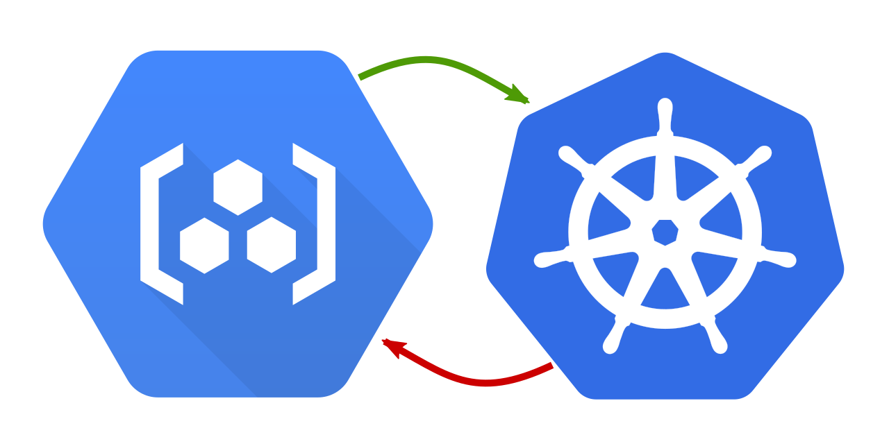

# k8s-gcr-auth-helper



  [](https://crates.io/crates/k8s-gcr-auth-helper) [](https://hub.docker.com/r/stephenc/k8s-gcr-auth-helper/) [](https://hub.docker.com/r/stephenc/k8s-gcr-auth-helper/)

A Kubernetes authentication helper to expose per-user credentials as Image Pull Secrets for Google Container Registry

## Build


```
cargo install k8s-gcr-auth-helper
```

*NOTE:* On Windows, if you are having trouble building with native TLS you can switch to rustls, e.g.

```
cargo install k8s-gcr-auth-helper --no-default-features --features rustls-tls
```                                                   

The docker image also needs to be built and available to your Kubernetes cluster if you want to use the `add` mode. For example to test your local changes using k3d

```                        
# set up a cluster to test with
k3d create --name auth-test
export KUBECONFIG=$(k3d get-kubeconfig --name auth-test)

# build the controller image with local changes (do not use :latest as that will pull Always)
docker build --tag k8s-gcr-auth-helper:local .                                               

# run the local changes helper
cargo run -- add --controller-image k8s-gcr-auth-helper:local --service-account default gcr-secret

# now deploy your services into k3d that use a GCR hosted image

# when done, so you can try again
cargo run -- remove --service-account default gcr-secret

# when really done
k3d delete --name auth-test
```

## Use

To install in the current namespace of your current Kubernetes cluster:

```
k8s-gcr-auth-helper add gcr-pull-secret-name
```                                                                    

To install and add to the default service account

```
k8s-gcr-auth-helper add --service-account default gcr-pull-secret-name
```                                                                    

To install and add to the all service accounts in the namespace

```
k8s-gcr-auth-helper add --all-service-accounts gcr-pull-secret-name
```                                                                    

*NOTE:* You can specify multiple `--service-account` arguments to install in multiple service accounts. To install in multiple namespaces run the command multiple times (with `--namespace` if you want to avoid changing namespace)

The first time the command is run it will open a browser to get an OAuth2 refresh token which will be stored in the cluster. 
A refresh service deployment will be created that listens for auth failures and refreshes the access token secret as required.

To remove use the same command with `add` replaced by `remove`, e.g.:

```
k8s-gcr-auth-helper remove gcr-pull-secret-name
```     

*NOTE:* If you have manually added an `imagePullSecrets` reference to additional service accounts you can specify them with `--service-account ...` or you can just purge the secret reference from all accounts with `--all-service-accounts`. If you forget you can always edit the service accounts manually. 
